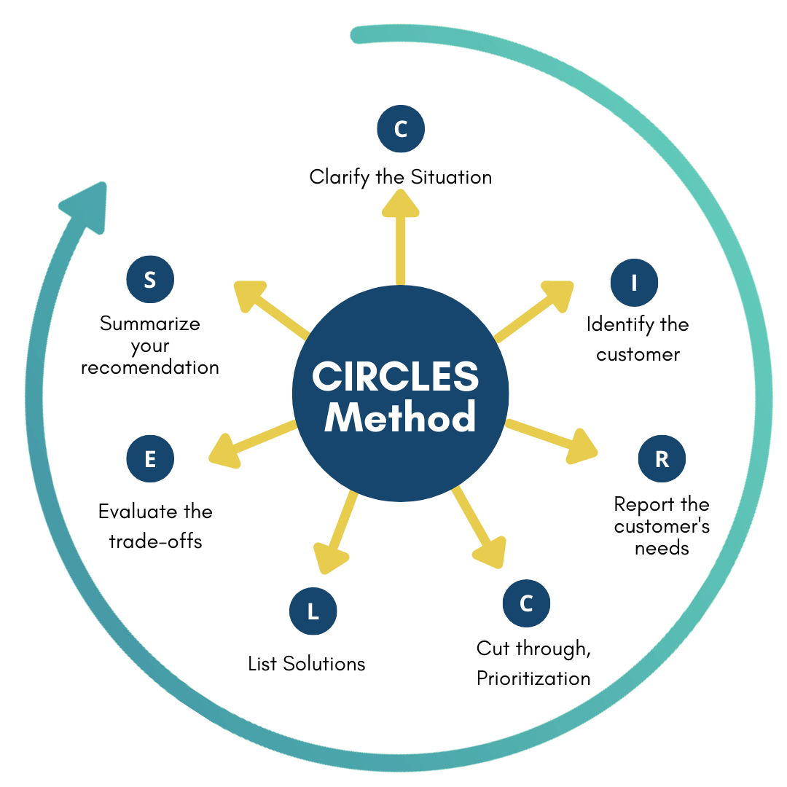

# Structured Prompt Format
In general, the prompts will follow the following structure

1. Role & Goal
2. Step-by-step instructions
3. Expertise
4. Constraints
5. Personalization
6. Examples

# Product Management Lifecyle
Below is a typical product management lifecycle
```markdown
Idea Generation -> Market Research -> Product Planning -> Development -> Launch -> Post-Launch -> Growth and Scaling
```

As part of this project, we will focus on each of these buckets and create prompts that will assist in the entire lifecyle. However, the majority of the focus will be spent on Idea Generation, Product Planning and Growth.

## Idea Generation
We will follow the CIRCLES framework developed by Lewis C. Lin for idea generation. We will then blend it with additional business information to create a lean canvas for your product.



[Source: CIRCLES Framework](https://www.lewis-lin.com/blog/circles-method-diagram-updated-for-2022)

### Step 1: Clarify the situation
The purpose of this step is to generate enough context for the LLM to generate high-quality ideas. The prompts are tuned to act as consultants and solicit the necessary information from you in a structured manner.